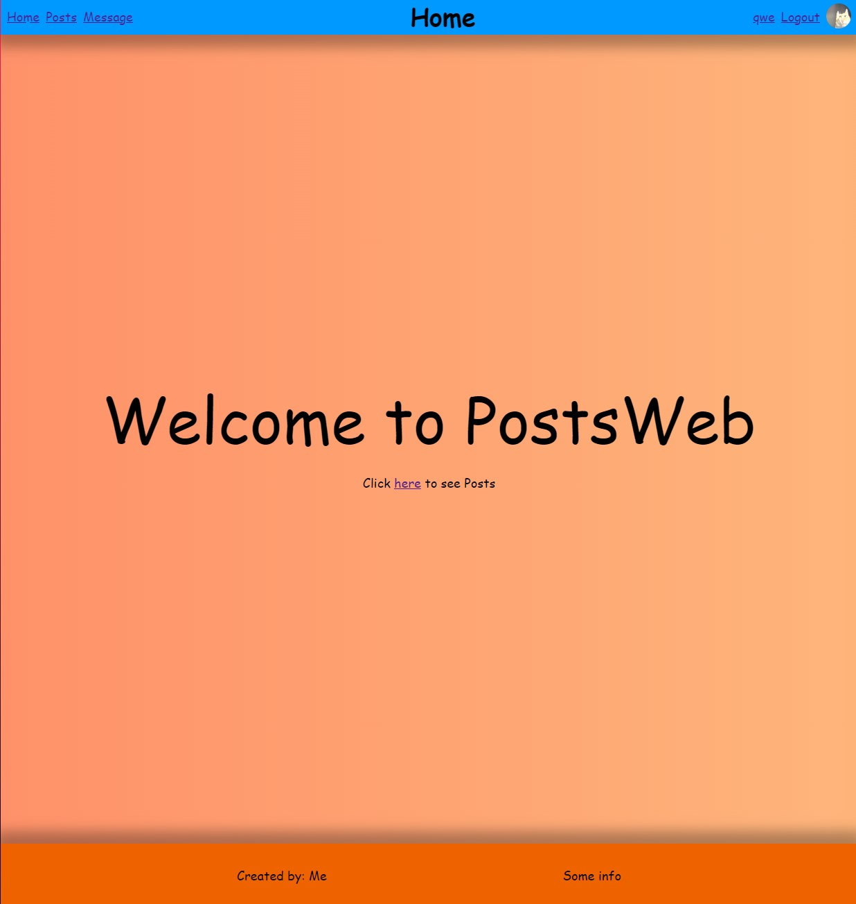
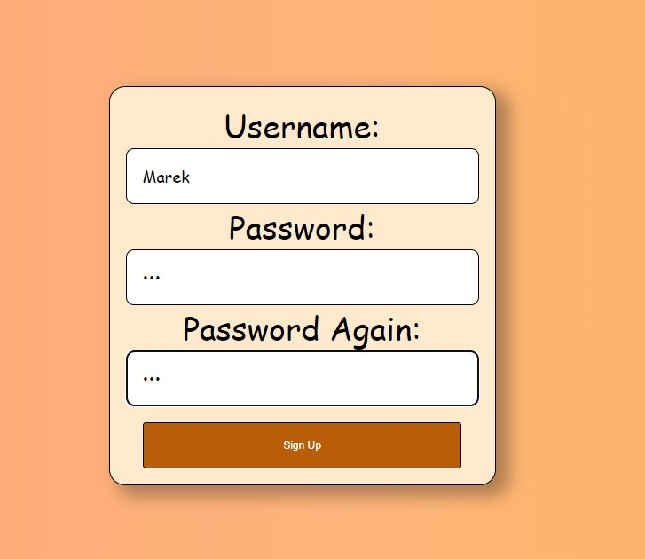
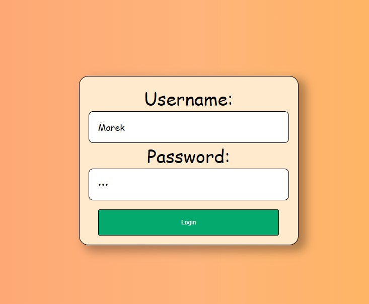
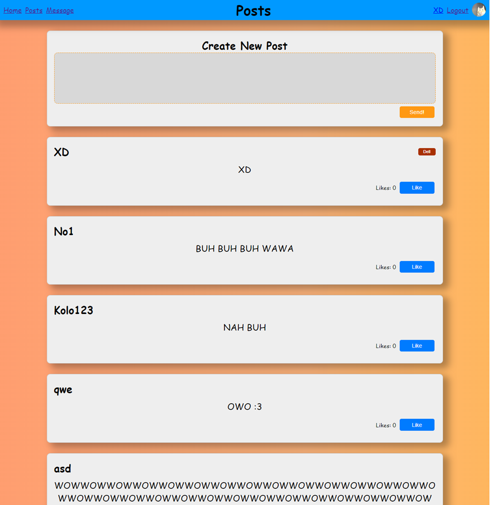
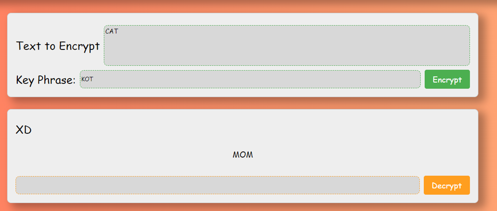

# Postweb

## Overview

Postweb is a web application that allows users to register, log in, publish text posts, and like posts from other users. The project utilizes technologies such as HTML, CSS, JavaScript, MySQL, and PHP.

## Features

### User Registration

Creating a profile is done through a simple user interface. The user can enter a username and password. If the user makes an error, they receive feedback, such as missing fields or incorrect password confirmation.

### User Login

The login process is similar to registration, using a simple user interface. Upon successful login, the user's data is stored in a session, allowing them to remain logged in until they click the logout button.

### Posting and Liking

When logged in, users can publish text content, which is saved in the database and displayed to all users. Additionally, users can like and delete their own posts.

### Vigenère Cipher

The Vigenère cipher is a classical encryption technique that uses a key for both encryption and decryption. In this cipher, each letter of the plaintext is shifted by a certain number of places in the alphabet, depending on the corresponding letter in the key. The same key is used for both encryption and decryption, ensuring simplicity and effectiveness.

## Database Structure

The MySQL database includes the following tables:

- `users`: Stores user information.
- `posts`: Stores user posts.
- `messages`: Stores messages encrypted with the Vigenère cipher.
- `liked_posts`: Stores information about liked posts, allowing users to track their liked posts.

## Role of PHP

PHP plays a key role in controlling the MySQL database and implementing various functions. PHP handles communication with the MySQL database, enabling operations such as adding, deleting, editing, and reading data. Additionally, PHP implements various functions that control the application logic, such as user authorization, encryption and decryption of data, post management, and managing liked posts.

## Technologies Used

- **HTML**: For structuring the web pages.
- **CSS**: For styling the web pages.
- **JavaScript**: For adding interactive elements.
- **MySQL**: For managing the database.
- **PHP**: For server-side scripting and database interaction.

